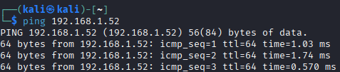
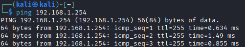

# Host Discovery

**Name**: Simon Klingesberger
**Fach**: ITSE
**Klasse**: 4 AHITS
**Datum**: 29.09.2025

## Ping

### Aufgabenstellung

Als host discovery (host scanning) versteht man den Vorgang um unbekannte Geräte in einem Netzwerk zu finden, bzw. festzustellen ob bekannte Geräte im Netzwerk erreichbar sind.

- Das einfachste Werkzeug dafür ist ping.

- Verwende Kali und Metasploitable im Bridged Mode (Bridge ins Labor-Netzwerk)
Experimentiere mit ping im Labor-Netzwerk (Metasploitable, Default Gateway, …)
- Recherchiere zu den Optionen von ping, erstelle ein kleines Cheat Sheet
- Welchen Netzwerkdienst verwendet der ping Dienst? Recherchiere wie Firewalls häufig mit ping umgehen.

### VMs in bridged setzen

Als erstes Rechte mit lokaler Admin geben. Dann bei der Vm den Pfad eingeben
```
Player->Manage->Virtual Machine Settings->Network Adapter-> Network Connection
```
Und dann bei bridged den Punkt setzen und bei Configure Adapters das Labornetz auswählen.

### Pingen

Ping von Kali zu MS:



Ping von Kali zu Default Gateway:



Alle Pings wurden erfolgreich ausgeführt.

### Optionen

#### Option -c &lt;Anzahl&gt;

Anzahl der Pings

#### Option -t &lt;Anzahl der Hops&gt;

TTL also anzahl der Hops

####  Option -s &lt;Bytes&gt;

Packetgröße in Bytes ändern

#### Option -W &lt;Sekunden&gt;

Timeout für Antworten

### ICMP(Internet Control Message Protocol)

Ping verwendet ICMP-Protocol also Echo-Request und Echo-Reply. Die ICMP Nachrichten werden von Firewalls oft verworfen für mehr Sicherheit. 

## Ping Script

### Aufgebenstellung

Schreibe ein shell Skript das automatisiert (Schleife) alle Hosts im subnet anpingt. Die Ausgabe soll so sein, dass man daraus die aktiven Hosts erkennen kann (für nicht aktive Hosts soll keine Ausgabe sein).

### Script

```
#!/usr/bin/env bash
# scan_parallel.sh - schneller Scanner, killt bei STRG+C alle laufenden pings
BASE="${1:-192.168.1}"
CONCURRENCY="${2:-100}"   # Anzahl paralleler Pings (anpassen)
 
trap 'echo; echo "Abbruch: beende alle laufenden Pings..."; kill -- -$$ 2>/dev/null; exit 1' INT
 
for i in $(seq 1 254); do
  {
    ip="$BASE.$i"
    if ping -c1 -W1 -n "$ip" >/dev/null 2>&1; then
      echo "$ip"
    fi
  } &
 
  # concurrency limit
  while [ "$(jobs -rp | wc -l)" -ge "$CONCURRENCY" ]; do
    wait -n 2>/dev/null || break
  done
done
```


