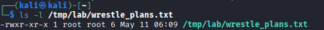
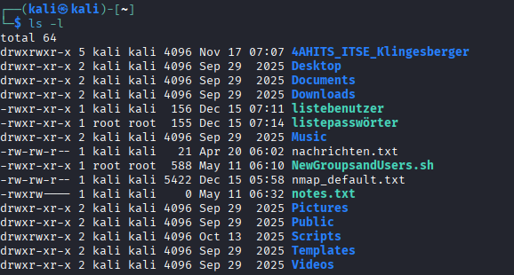
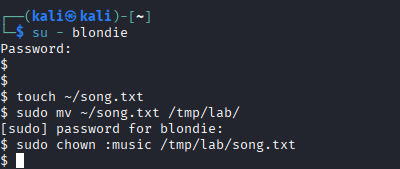

# Linux Permissions

## Vorbereitung der Übungsumgebung

### Aufgabenstellung 

Betrachte folgendes Skript und finde heraus was es macht. Anschließend führe das Skript als User kali mit sudo aus, um die Laborumgebung einzurichten:
```
#!/bin/bash

 Gruppen anlegen
groupadd music
groupadd wrestle
groupadd emperors

 User anlegen und Gruppen zuweisen
useradd -m -G music elvis
useradd -m -G music,wrestle blondie
useradd -m -G wrestle hogan
useradd -m -G emperors nero

 Passwörter auf 'kali' setzen
echo "elvis:kali" | chpasswd
echo "blondie:kali" | chpasswd
echo "hogan:kali" | chpasswd
echo "nero:kali" | chpasswd

 Lab-Struktur vorbereiten
mkdir -p /tmp/lab/gigs /tmp/lab/drafts
echo "Draft" > /tmp/lab/drafts/lyrics.txt
echo "Plans" > /tmp/lab/wrestle_plans.txt
chown -R root:root /tmp/lab
chmod -R 755 /tmp/lab
```

### Lösung

Das Skript NewGroupsandUsers.sh richtet eine Laborumgebung ein. Es legt drei Gruppen an (music, wrestle, emperors), erstellt vier User (elvis, blondie, hogan, nero) mit jeweiliger Gruppenzuweisung und setzt für alle das Passwort kali. Abschließend wird die Verzeichnisstruktur /tmp/lab/ mit den Unterordnern gigs und drafts sowie zwei Textdateien angelegt, alles im Besitz von root mit Rechten 755.


## Übung (Analyse und Symbolic Mode)

### Aufgabenstellung

1. Rechte auslesen: Ermittle die Permissions, den User Owner und den Group Owner der Datei /tmp/lab/wrestle_plans.txt?
2. Private Files: Erstelle eine Datei notes.txt. Ändere die Permissions so, dass der other-Klasse (o) das Read-Recht (r) entzogen wird. Nutze den symbolischen Modus von chmod.
3. Group Sharing: Setze die Permissions für notes.txt so, dass die group (g) die Datei lesen (r) und schreiben (w) darf, während der user (u) alle Rechte behält und others (o) keinerlei Zugriff haben. Verwende für die Änderung einen einzigen chmod Aufruf.
4. Skript-Vorbereitung: Erstelle die Datei myscript.sh. Welchen Befehl nutzt du, um dem user (u) und der group (g) das Recht zu geben, dieses File auszuführen (x)?
5. Kollektive Änderung: Erstelle die Datei data.txt. Entziehe mit einem einzigen Befehl im symbolischen Modus sowohl der group (g) als auch others (o) die Write- (w) und Execute-Rechte (x) für die Datei data.txt.

### Lösung

#### 1. Rechte Auslesen

Permissions im Detail:
- KlasseRechteUser (root)rwx – lesen, schreiben, ausführen
- Group (root)r-x – lesen, ausführen
- Othersr-x – lesen, ausführen



#### 2. Private Files

Mit touch notes.txt wurde die Datei erstellt. Anschließend wurde mit 

```chmod o-r```

 notes.txt der other-Klasse das Leserecht entzogen, sodass fremde User die Datei nicht mehr lesen können.

 #### 3. Group Sharing

Mit dem Befehl 

```chmod u=rwx,g=rw,o= notes.txt```

 wurden die Permissions für notes.txt in einem einzigen Aufruf gesetzt. Der User behält alle Rechte (rwx), die Group darf lesen und schreiben (rw), und Others haben keinerlei Zugriff (---).


 

#### 4. Skript-Vorbereitung

Bericht
Mit 

```chmod ug+x myscript.sh```

 wurde dem User und der Group das Execute-Recht hinzugefügt. Die restlichen Permissions blieben unverändert. Die Datei ist nun für User und Group ausführbar.


#### 5. Kollektive Änderung

Mit 

```chmod go-wx data.txt```

 wurden der Group und Others die Write- und Execute-Rechte in einem einzigen Befehl entzogen. Da beide Rechte bei Group und Others bereits nicht gesetzt waren, blieben die Permissions unverändert bei -rw-r--r--. Der Befehl wurde korrekt ausgeführt.

 


 ## Übung (Ownership und Gruppenkollaboration)

 ### Aufgabenstellung

1. Wechsle mit sudo su in eine root shell. Füge den User blondie so zu /etc/sudoers hinzu (mit visudo), dass dieser die Befehle mv und chown als root ausführen darf.
2. Group Change: Wechsle zum User blondie (su - blondie). Erstelle die Datei song.txt in deinem Home-Verzeichnis. Verschiebe die Datei anschließend nach /tmp/lab/ (verwende dafür sudo). Ändere danach den Group Owner der Datei auf music.
3. Experimentiere mit dem Unterschied von su und su - bei wechsel auf einen anderen User. Hinweis: mit exit kehrt man zum vorhergehenden User zurück, d.h. die User Session bleibt geöffnet während man mit su zu einem anderen User wechselt.
User Transfer: Du bist als root angemeldet. Mache elvis zum User Owner der Datei /tmp/lab/song.txt?
4. Wrestler-Szenario:
Wechsle zum User hogan (su - hogan). Erstelle die Datei /tmp/lab/training.txt. Gehe dazu vor wie beim User blondie.
Ändere die Gruppe der Datei auf wrestle.
Setzt die Rechte so, dass die group lesen und schreiben darf, othersaber keinerlei Rechte besitzt.
5. Einschränkungen: Du bist als User elvis angemeldet. Er ist Mitglied in music, aber nicht in emperors. Welchen Befehl müsstest du eingeben, um zu versuchen, den Group Owner eines Files auf emperors zu ändern? Warum schlägt dieser Befehl fehl?

### Lösung


#### 1. Visudo Blondie 

Als User blondie wurde die Datei song.txt im Home-Verzeichnis erstellt. Anschließend wurde die Datei mit sudo mv nach /tmp/lab/ verschoben und mit sudo chown :music der Group Owner auf music gesetzt. Die abschließende Überprüfung mit ls -l bestätigt: User Owner ist blondie, Group Owner ist music, Permissions sind -rw-rw-r--.




