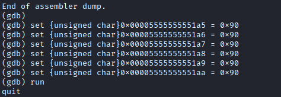
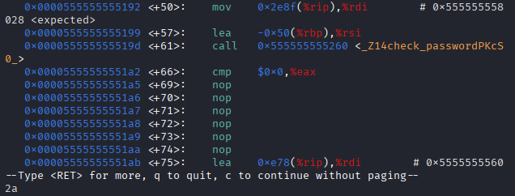
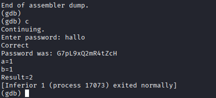
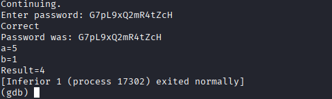

# OPCODE Patching

## JE Befehl ersetzen durch MOP Befehl 

Mit dem Befehl 
```
gdb pwcheck
``` 
wird das programm mit gdb gestartet dann muss man mit 
```
b main
```
den Breakpoint im Main gesetzt

Wir haben die Funktion gefunden in der das Passwort geprüft wird. Danach findet man je Befehl dieser wird aktiviert wenn Rückgabe False ist also ersetzen wir diesen befehl durch mop also einen Befehl der nichts tut und nicht jumped.

Das sieht man hier:



Danach sieht man im code dass der Jump if Equal Befehl durch mop Befehle ersetzt wurde.



Bei dem befehl
```
c
```
c steht für Continue 

Wird es dann ausgeführt und man kommt ohne richtiges passwort in den Versteckten code unten.



Das Passwort ist G7pL9xQ2mR4tZcH

## Übung (pwn add to sub)

### Angabe

Nach der Passwortabfrage liest das Programm 2 Zahlen ein und addiert diese. Manipuliere mit gdb die Binärdaten des Programms so dass statt der Addition eine Subtraktion ausgeführt wird.

### Lösung

Man ändert statt add ein sub also wird das eine Minus das andere gerechnet ich habe mir die Zeile herausgesucht.

```
0x0000555555555224 <+196>:   add    -0xc(%rbp),%eax
```

Mit diesem Befehl wird die zeile durch sub ersetzt:

```
(gdb) set *(unsigned char*)0x0000555555555224 = 0x2b
```

Das 0x2b steht für Subtrahieren


Und hier die Ausführung:




